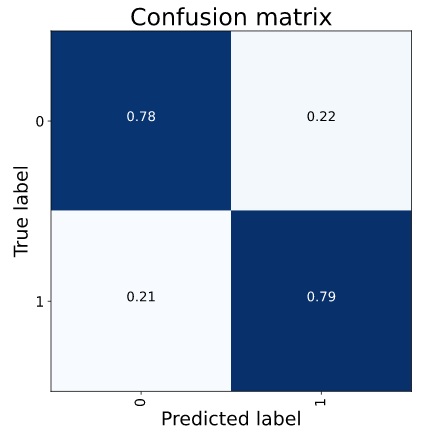
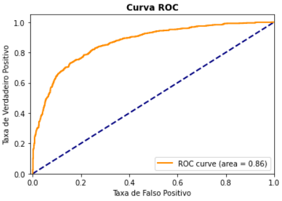
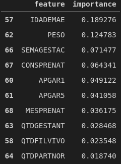

# data_science_for_health_unicamp

# Projeto `Perfil de morbidade e mortalidade de recém-nascido com anomalias congênitas no Brasil entre 2005 a 2019.`

# Project `<Title in English>`

# Apresentação

O presente projeto foi originado no contexto das atividades da disciplina de pós-graduação [_Ciência e Visualização de Dados em Saúde_](https://github.com/datasci4health/home), oferecida no primeiro semestre de 2021, na Unicamp.

| Nome                             | RA     | Especialização |
| -------------------------------- | ------ | -------------- |
| Matheus Gustavo Alves Sasso      | 158257 | Computação     |
| Giancarlo Schaffer Torres Junior | 263890 | Computação     |
| Maria Estela de Oliveira Paiva   | 263885 | Computação     |
| Kedma Teixeira Montedori         | 098182 | Saúde          |

# Descrição Resumida do Projeto

Projeto é motivada pela especialidade da Kedma na área de desenvolvimento infantil. Sabendo que as malformações congênitas representam importante problema de saúde pública, tendo em vista suas repercussões no crescimento e desenvolvimento infantil nosso projeto contempla os pontos a seguir:

- Interface a qual seja possível verificar as causas de disfunções de malformação de nascidos vivos podendo ser consultadas por estado/microrregião.

- Sistema de inteligência artificial que retornará o impacto de cada variável de entrada para que seja predita uma classe de anomalia na saída.

[Vídeo de Apresentação](https://youtu.be/DN1tSBkntmY)

# Perguntas de Pesquisa

Qual o perfil de morbidade e mortalidade dos recém-nascidos com anomalias congênitas de acordo com os estados brasileiros no período entre 2010 a 2019 para o estado de São Paulo?

# Metodologia
Foram extraidos do SINASC , base do Datasus com dados de recém nascidos vivos, todos os dados correspontes ao intervalo de 2010 a 2019 no estado de São Paulo. Destes dados foram extraídos os dados de recém nascidos que possuiam a anomalia de Sindrome de Down, com codificação na base variando de Q900 a Q909.

Rotulou-se com a classe 1 os recem nascidos que possuiam a anolaia e aleatoriamente escolhou-se o mesmo numero de recém nascidos que não possuiam nenhuma anomalia ou anomalias não relacionadas a Sindrome de Down. Os dados categóricos foram codificador em one hot e após isso normalizou-se todos os dados dentro de um MinMax Scaler.

O modelo utilizado foi o Random Forest e com o mesmo pode-se extrair a influencia de cada feature no resultado final, com acurácia próxima a 75%. Percebeu-se alguns fatores que ja se esperava do conhecimento da medicina, como a alta influência da idade mãe para que o nascido possua Sindrome de Down.

# Bases de Dados

A base de dados utilizada no problema em questão é o SINASC do datasus, o qual, possui dados a respeito de nascidos vivos estão separados por estado, e com temporalidade de 1994 a 2019. Entrtanto escolheu-se apenas SP para limitar o contexto dos dados devido a grande quantidade e o periodo de 2010 a 2019, pois antes de 2010 menos dados eram oferecidos pela base.

## Bases Estudadas mas Não Adotadas

Base de Dados | Endereço na Web | Resumo descritivo
----- | ----- | -----
Título da Base | http://base1.org/ | Breve resumo (duas ou três linhas) sobre a base.

## Bases Estudadas e Adotadas

A base utilizada foi o SINASC, entrtanto para fazer a coleta dos dados utilizou-se o pacote PySUS.

Base de Dados | Endereço na Web | Resumo descritivo
----- | ----- | -----
SINASC | [http://base1.org/ ](http://www2.datasus.gov.br/DATASUS/index.php?area=0205&id=6936&VObj=http://tabnet.datasus.gov.br/cgi/deftohtm.exe?sinasc/cnv/nv)| Base de dados do DATASUS sobre nascidos vivos.


*O que descobriu sobre esse banco?
É possível pegar as colunas cruzadas com os estados uma a uma pelo site. O PySUS surgiu como altenativa para fazer a coleta automatizada.

*Quais as transformações e tratamentos (e.g., dados faltantes e limpeza) feitos?
Descoberta dos valores que correspondiam a valores nulos não intuitivos, através da leitura dos relatórios
Dados inputados em variáveis numéricas NaN com o Iterative Imputer do sklearn
Dados inputados em variáveis caategóricas NaN pelo valor máximo
One Hot encoding das variáveis categóricas

*Por que este banco foi adotado?
Principal base de dados brasileira sobre nascidos vivos

*Apresente aqui uma Análise Exploratória (inicial) sobre esta base.
Visualização dos histogramas dos dados, valores faltantes e tipos dos dados. Além disso foi necessário entender o relatório do SINASC para saber o significado de cada uma das variáveis, que ja estavam codificadas na base.

# Ferramentas

* Python e libs (Pysus, pandas…) para tratar dados e criar modelo
* DVC para fazer o storage dos dados 
* React para desenvolver interface front-end (Ainda não implementado)
*  Fast API para servir os resultados para o front-end (Ainda não implementado)

# Cronograma

| Etapas                                                  | Semanas   |
| ------------------------------------------------------- | --------- |
| Seleção inicial dos dados e Pré-processamento dos dados | 4 semanas |
| Data mining                                             | 3 semanas |
| Interface web                                           | 2 semanas |
| Criação de apis                                         | 1 semana  |
| Integração com interface e deploy                       | 1 semana  |
| Relatório                                               | 3 semanas |
| Testes e correções                                      | 2 semanas |

|                                                         | 1   | 2   | 3   | 4   | 5   | 6   | 7   | 8   | 9   | 10  |
| ------------------------------------------------------- | --- | --- | --- | --- | --- | --- | --- | --- | --- | --- |
| Seleção inicial dos dados e Pré-processamento dos dados | X   | X   | X   | X   |     |     |     |     |     |     |
| Data mining                                             |     |     |     |     | X   | X   | X   |     |     |     |
| Interface web                                           |     |     |     |     | X   | X   |     |     |     |     |
| Criação de apis                                         |     |     |     |     |     |     | X   |     |     |     |
| Integração com interface e deploy                       |     |     |     |     |     |     |     | X   |     |     |
| Relatório                                               |     |     |     | X   |     |     |     | X   |     | X   |
| Testes e correções                                      |     |     |     |     |     |     |     |     | X   | X   |

# Project Organization

---

├── LICENSE
├── README.md          <- apresentação do projeto
│
├── data
│   ├── external       <- dados de terceiros
│   ├── interim        <- dados intermediários, e.g., resultado de transformação
│   ├── processed      <- dados finais usados para a modelagem
│   └── raw            <- dados originais sem modificações
│
├── models             <- Pasta em que modelos treinados são salvos
│ 
├── notebooks          <- Jupyter notebooks ou equivalentes
│
├── src                <- fonte em linguagem de programação ou sistema (e.g., Orange)
│   └── README.md      <- instruções básicas de instalação/execução
│
└── assets             <- mídias usadas no projeto

---

<p><small>Project based on the <a target="_blank" href="https://drivendata.github.io/cookiecutter-data-science/">cookiecutter data science project template</a>. #cookiecutterdatascience</small></p>

# Como rodar este projeto?

## Dockerfile (Sera utilizado na intragração do sistema)
Para garantir que é possível importar todas as bibliotecas basta buildar e rodar o dockerfile com os seguintes comandos na raiz do projeto.

Buildar docker image
```bash
sudo docker build -t ds_health_img .
```

Rodando o dockerfile
```bash
sudo docker run -it -p 8080:8080 --name ds_health -v $(pwd):/app ds_health_img
```

## Preparando para rodar Notebooks 

Criar Virtual Enverionment e Instalar os requiremets
```bash
python3 venv -m .venv
source .venv/bin/activate
pip install -r requirements.txt
```

# Distribuição dos dados de entrada
Histograma de distribuição dos dados de entrada antes da criação dos one hot encodings para as variáveis categóricas


# Resultados

## Matriz de Confusão
Matriz de confusão avaliada no conjunto de teste




## Curva ROC
Curva ROC avaliada no conjunto de teste




## Importância das Features
Importância das features de entrada segundo o algorítimo de Random Forest para a determinação das classes




# Parcer técnico sobre do especialista sobre os resultados obtidos


O termo “síndrome” significa um conjunto de sinais e sintomas e “Down” designa o sobrenome do médico e pesquisador que primeiro descreveu a associação dos sinais característicos da pessoa com SD
 
A Síndrome de Down (SD) ou trissomia do 21 é uma condição humana geneticamente determinada, é a alteração cromossômica (cromossomopatia) mais comum em humanos e a principal causa de deficiência intelectual na população. A SD é um modo de estar no mundo que demonstra a diversidade humana. A presença do cromossomo 21 extra na constituição genética determina características físicas específicas e atraso no desenvolvimento. Sabe-se que as pessoas com SD quando atendidas e estimuladas adequadamente, têm potencial para uma vida saudável e plena inclusão social. No Brasil nasce uma criança com SD a cada 600 e 800 nascimentos, independente de etnia, gênero ou classe social.
 
As diferenças entre as pessoas com SD, tanto do aspecto físico quanto de desenvolvimento, decorrem de aspectos genéticos individuais, intercorrências clínicas, nutrição, estimulação, educação, contexto familiar, social e meio ambiente. Apesar dessas diferenças, há um consenso da comunidade científica de que não se atribuem graus à SD. Um dado importante recorrente e atualmente descrito no boletim epidemiológico de 2021 revela que nos nascidos com síndrome de Down, um alto percentual de mães com idade avançada foi identificado.  Acrescenta-se também a importância do índice ou escore APGAR,  um teste feito no recém-nascido logo após o nascimento que avalia seu estado geral e vitalidade, que auxilia na identificação da necessidade de qualquer tipo de tratamento ou cuidado médico extra após o nascimento. Embora O índice de Apgar seja uma avaliação rotineira da vitalidade do bebê tem ganhado destaque como uma ferramenta útil para prever condição de saúde da mãe, sugere um estudo publicado no “JAMA Pediatrics”. Contudo O fato de o recém-nascido não ter “tirado” uma “nota” alta não significa que ele terá algum atraso no desenvolvimento, mas permite inferir que o bebê precisou de mais ajuda na adaptação à vida fora do conforto do útero.
Apesar das informações e experiência acumulada nos últimos anos, não é possível prever qual o grau de autonomia que uma criança com SD terá na sua vida adulta. O potencial a ser desenvolvido é sempre uma fronteira a ser cruzada diariamente. No entanto, é consenso para as equipes que atuam no cuidado da pessoa com SD que todo investimento em saúde, educação e inclusão social resulta em uma melhor qualidade de vida e autonomia. Para tanto é importante um conhecimento das relações dos indicadores de risco para manifestações sindrômicas assim como compreensão das possíveis desordens já instaladas bem como a prevenção destas.
 
O aconselhamento Genético (AG) consiste em uma destas alternativas sendo o mais adotado o da American Society of Human Genetics (EPSTEIN, 1975) . Segundo esta definição, trata-se do processo de comunicação que lida com problemas humanos associados com a ocorrência, ou risco de ocorrência, de uma doença genética em uma família, envolvendo a participação de uma ou mais pessoas treinadas para ajudar o indivíduo ou sua família a: 1) compreender os fatos médicos, incluindo o diagnóstico, provável curso da doença e as condutas disponíveis; 2) apreciar o modo como a hereditariedade contribui para a doença e o risco de recorrência para parentes específicos; 3) entender as alternativas para lidar com o risco de recorrência; 4) escolher o curso de ação que pareça apropriado em virtude do seu risco, obje- tivos familiares, padrões éticos e religiosos, atuando de acordo com essa decisão; 5) ajustar-se, da melhor maneira possível, à situação imposta pela ocorrência do distúrbio na família, bem como à perspectiva de recorrência do mesmo.
No caso do AG as famílias com uma pessoa com SD, este processo é muitas vezes realizado pelo pediatra, médico assistente ou equipe
aconselhamento dentro das normas estabelecidas pela comunidade médica, seguindo padrões éticos e técnicos adequados.
    Recomenda-se ainda que o cuidado com a saúde da pessoa com SD seja norteado pelas políticas públicas do Ministério da Saúde como a Política Nacional de Humanização, Política Nacional da Atenção Básica, Programas de Saúde da Criança e do Adolescente, Saúde da Mulher, do Homem, do Idoso, Saúde Mental e no Relatório Mundial sobre a Deficiência.
  Cada vez mais a sociedade está se conscientizando de como é importante valorizar a diversidade humana e de como é fundamental oferecer equidade de oportunidades para que as pessoas com deficiência exerçam seu direito em conviver em comunidade. A sociedade está mais preparada para receber pessoas com síndrome de Down e existem relatos de experiências muito bem-sucedidas de inclusão.  
 
 E ainda, que utilize os pressupostos teóricos da clínica ampliada, da integralidade e do cuidado compartilhado, com vistas à humanização, autonomia e protagonismo dos sujeitos nas práticas de saúde. Neste sentido a clínica ampliada busca articular estes enfoques, reunindo os diferentes saberes com o objetivo de garantir o melhor resultado no cuidado, por meio da acolhida, do diálogo e da participação do sujeito no processo terapêutico.
